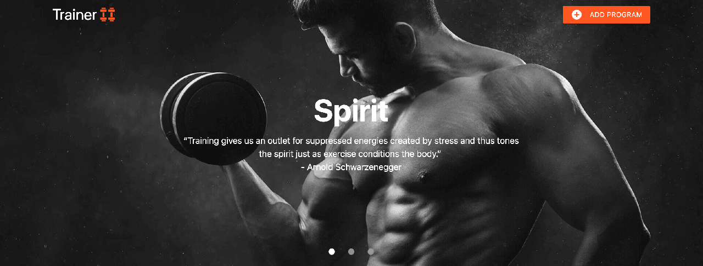

# Trainer 11

This web application serves as an easy to use workout builder with a single page exercise view, optimised for mobile devices. The application comprises of 4 pages for programs, workouts, exercises and form view. Each page provides a unique view to the user. The desired effect of the application is to enable users to post new workout programs and enable users to view and/or use the workout programs that have been listed on the application. The application was built using four major languages namely HTML5, CSS, JavaScript and Python. Together with these languages various libraries and frameworks were used to build the application, all of which are detailed in the deployment section.

## UX

### Function
This project is for personal trainers and people looking for new workout programs that would like to try new workouts or add workouts to the application. The exercise view is optimised to use on mobile while at the gym. This is a free application where the users add content much like social media applications. Currently, there are existing applications with similar functionality which the application owners add and manage the content (often subscription-based). The Trainer11 application is easy to use and easy to set up as defined in the deployment section.

### Styling
This application was built using the front-end framework called [Materialize](https://materializecss.com/) with minor adjustments to the default Materialize theme to improve responsiveness, custom look and feel. This theme was designed with a dark primary base with sharp bright orange accents to create a clean and focused look to the application. The orange accents used, draw the attention of the users thereby allowing the application owner to control what the users pay attention to on the application.

The font used is from the standard Materialize theme, called Roboto. The headings are a combination of bold 700 and regular 400 font-weight depending on their location and importance. All other text is regular 400 font-weight. Some additional styling used includes turquoise blue, red and orange links. The colours are based on the functionality of the links and lastly, the icons used are from [Google's Material Icons](https://material.io/) which compliments Materialize.

### User Stories
- As a developer, I want to expand on the project, so that I can customise the project to my needs without starting from the beginning.
- As an employer/client, I want to hire a capable developer, so I can complete my project successfully.
- As a personal trainer, I want to create online workout programs, so I can further my thought leadership when it comes to personal training.
- As a personal trainer, I want to provide online workout programs, so I can give workouts to my clients while they are on holiday.
- As a personal trainer, I want to find new workout programs for my clients, so I can challenge my clients with new exercises.
- As an active person, I want to find new workout programs, so I can challenge myself with new workouts.
- As an active person, I want to create online workout programs, so I can provide value to other users
- As a Code Institue Marker, I want to determine the student has achieved the learning outcomes so that I can score the level of achievement (out of 5).
- As a recruiter, I want to determine the prospects capabilities, so that I can place successful candidates.
- As a gym owner, I want to create online workout programs, so I can encourage users to join our gym.
- As a gym owner, I want to provide online workout programs to my clients, so my clients can get the maximum benefit from the gym.
- As a virtual trainer, I want to create online workout programs, so I can provide my clients with workouts.
- As a virtual trainer, I want to find online workout programs, so I can provide my clients with new workouts.

### Page Sections

#### Navbar Light
> This section consists of a small full-width bar with a transparent background that overlaps the header slider. The bar consists of the name and logo section on the left and an add program button on the right.

#### Navbar Dark
> This section consists of a small full-width bar with a dar background. This navbar is used when there is no header slider on the page to avoid clashing with the body background. The layout is the same as the Navbar Light.

#### Header
> This section consists of a 550px height full-width slick slider with three slides. Each slide has an h1 heading and a p element containing an inspirational quote relating to exercise. This section is used in the programs.html and workouts.html pages.

#### Programs Grid
> This section consists of a grid of cards with a width of one third each. Each card displays an image for the program with a description below followed by edit and delete link at the bottom of the card. Additionally, there is a floating button in between the image and description with a right arrow that takes the user to the workouts associated with the program. This grid section is prepended with a navigation breadcrumb. 

#### Workouts Grid
> This section consists of a grid of cards with a width of one third each. Each card displays an image for the workout with a workout title below followed by edit and delete link at the bottom of the card. Additionally, on clicking the card the workout description will slide up to display. The description has an exercises link below that navigates to the associated exercises. This grid section is prepended with a navigation breadcrumb.

#### Exercises View
> This section consists of a single row of two 50% width panels. The left panel displays the workout name and exercises metadata in pills. The right panel displays a slick slider for each exercise in the workout. Each exercise displays in a card with an image with a description below followed by edit and delete link in the footer. This section is prepended with a navigation breadcrumb.

#### Sidenav
> The left panel from the Exercises View becomes the Sidenav content displayed on mobile view. This Sidenav has a small handle fixed to the left of the screen to pop-out the side nav.

#### Programs Form
> This section consists of a collapsible with three sections. Each section has a form which allows the user to CRUD on the related item (Programs, Workouts and Exercises). Depending on the users' actions the relevant buttons will be made available to add, view, update and delete the relent item using AJAX and JavaScript. 

#### Modal
> This section is displayed when the delete link is clicked on the program, workout or exercise card. the modal acts as a deletion confirmation (Yes / No) for the selected item.

#### Footer
> This section consists of two rows. The first row consists of three major elements of one third each. T1 displays an inspirational quote with social media buttons below. T2 and T3 display links to programs and workouts respectively. The second row displays a left-aligned copyright text and right-aligned add program link.

### Mockups
The project mockups are available below and in the [mockups directory](https://github.com/K0vacs/traineroneone/tree/master/static/images) in mobile, tablet and desktop views:

#### Mobile
- 

#### Tablet

- 

#### Desktop

- [Program Mockup](https://raw.githubusercontent.com/K0vacs/traineroneone/master/static/images/Desktop-programs.png)
- [Workout Mockup](https://raw.githubusercontent.com/K0vacs/traineroneone/master/static/images/Desktop-workouts.png)
- [Exercise Mockup](https://raw.githubusercontent.com/K0vacs/traineroneone/master/static/images/Desktop-exercises.png)
- [Form Mockup](https://raw.githubusercontent.com/K0vacs/traineroneone/master/static/images/Desktop-form.png)

## Features
 
### Existing Features
- Responsiveness - allows the application to render in a user-friendly format on any device (mobile, tablet and desktop). 
- Modal - acts as a confirmation message to users when the delete link is selected.
- Sidenav - hides the workout name and metadata on the exercises view to allow for an unobstructed view of exercises on mobile devices.
- Slider - allows for a more polished look on page load as a hero slider and allows exercises to be viewed one by one so users focus on each exercise at a time.
- Quote Generator - this randomly selects a quote to display in the footer which allows the user to get inspiration every time the page is loaded. This feature is implemented by creating a custom Python module which can be found in helpers.py
- Programs View - this view displays a grid of programs with a description, title, delete link, edit link and next button which takes you to the selected programs' workouts.
- Workouts View - this view displays a grid of programs with a title, delete, link, edit link and card details button which opens the card overlay with the card title, description, close button and go to exercises link which takes you to the selected workouts exercises.
- Exercises View - this view displays two 50% width sections. The left has the workout name and metadata. The right has the exercise card with image, sets, reps, description, delete link and edit link. These cards are placed in a slider to easily flip through each exercise in the workout.  
- Program Form - this form allows the user to read, create and update programs workouts and exercises. Once saved these items will appear in the program, workout and exercise views.
- Form Validation - each form has custom front-end validation which prevents the user from submitting a form without entering all the necessary fields.

### Features to Implement
- Add Program View filters to allow users to filter programs based on multiple criteria
- Edit all workouts and exercises attached to a program at the same time
- Add program goals to programs like weight loss or muscle gain
- Add an indicator that shows what equipment is required for the workout or exercise
- View all workouts that exist irrespective of the attached program
- View all exercises that exist irrespective of the attached workout
- Add video file optimised support to program, workout and exercise uploads
- View media attached to workouts and exercises in the multi-select options
- Hero slider to display featured programs and workouts
- Add a support feature to log defects

## Technologies Used

### Languages
- HTML / HTML5 - To display content on each HTML page and enable the use of more semantic elements used in HTML5.
- CSS / CSS3 - To style content in each HTML page and enable additional styling features by using CSS3.
- JavaScript - To make HTML content more dynamic and to enable features that are supported by Materialize, jQuery and Python.

### Libraries
- Materialize - to speed up the building of the project using the front end framework that has been tried and tested.
- Material Icons - To make the project more visually appealing to users through the use of icons.
- Google Fonts - To make enable custom fonts to be used in the project. Segoe UI (Primary) and Roboto (Secondary) were selected.
- jQuery - To simplify Dom manipulation and to enable Materialize features.
- Flask - To simplify and speed up the building of a Python project, this includes the Flask dependencies and; 
    - render_template - To render a template at a specified route
    - request - To handle GET, POST and PUT requests from the browser
    - url_for - To provide dynamic URLs based on the file location
    - redirect - To redirect traffic to the desired URL
    - PyMongo - To assist Python application with connecting to Mongo DB
    - secure_filename - To create secure file names for user uploaded files (Part of Werkzeug a Flask dependency)
- Python3 Modules;
    - os - Python operating system
    - JSON - convert JSON to Python objects
    - boto3 - CRUD on AWS S3 Bucket
    - datetime - creates and manages date objects
    - random - can be used to create random integers
    - helpers - custom created module to select quotes

## Testing
This project was tested using the Google Chrome Inspect tool. Using the aforementioned tool the website was tested using multiple screen sizes. These screen sizes include various mobile, tablet, and desktop sizes using both portrait and landscape views. The Jasmine automated testing tool and Python unit testing tools were considered but proved unnecessary as very few functions return a specific int or string result.

The following checks were done to ensure the website is working as intended:
- All links working and directed correctly
- All styles applied and display correctly
- All icons displayed with the intended styling
- All navigation elements are working as intended
- All modals are operating as intended
- Form fields are all required on submit
- Form uploads are uploaded to the S3 Bucket as expected
- Updating uploads are removed and replaced as expected
- Form creates programs, workouts and exercises as expected
- MongoDB records are inline with each view
- Database records are saved in the expected layout and type
- CloudFront is cashing uploaded images
- W3C validator HTML errors fixed
- W3C validator CSS errors fixed
- Google Dev Tools Audit run and fixed issues on each page
- JSHint errors and warnings fixed (for all that were necessary
- JavaScript Ajax functions return the appropriate error when a failure occurs

## Deployment

### This Deployment
This project has been deployed on Heroku using the following method:
- A Cloud9 workspace was created and Flask was installed
- A GitHub repo was created and linked to the Cloud9 Git instance
- A MongoDB was created to run the applications Database and linked to the Flask App using PyMongo (the necessary environment variables were created)
- An S3 Bucket was created in AWS and linked to the Flask App using Boto3
- A CloudFront configuration was completed to Cache images uploaded
- The GitHub repo was connected to Heroku using the Heroku user interface (App > Settings > GitHub), allows for automatic Heroku deployment from the GitHub master branch which redeploys on every commit to the master branch
- The Cloud9 Flask App was configured to the Heroku deployment through creating a Procfile, requirements.txt file and creating the necessary environment variables in both Cloud9 and Heroku

> The deployed version is the latest version of the application

### Deploy your Own
To deploy this application on Heroku using GitHub, MongoDB, AWS S3 and CloudFront do the following:
- Clone the repository from this page using the clone or download button which will copy the clone link to your clipboard
- Using your chosen IDE initialise git and clone the repo using the clone link
- Once complete install the necessary dependencies for the App using "pip3 install -r requirments.txt" in your command-line interface
- Create a MongoDB database with the same naming conventions which can we found in app.py. Also, create the "MONGO_URI" environment variables
- Create an AWS S3 Bucket to store uploaded images. The AWS S3 "S3_BUCKET", "AWS_ACCESS_KEY_ID" and "AWS_SECRET_ACCESS_KEY" environment variables should be set
- Configure a CloudFront installation for images stored in the S3 Bucket using this [tutorial](https://docs.aws.amazon.com/AmazonCloudFront/latest/DeveloperGuide/GettingStarted.html)
- Create a GitHub repo and connect it to your IDE version of the App by following the setup instructions on GitHub
- Create a Heroku app and connect it to your newly created GitHub Repo. In Heroku (App > Settings > GitHub) to complete the connection
- Complete an initial commit, push it to GitHub and troubleshoot the results on the Heroku deployment

## Contribute
Developer contributions are welcomed and encouraged.

To contribute just fork the GitHub repository, follow the deployement instructions and when ready create a push request with detailed notes of the changes which will be reviewed and added to the project on success.

Feel free to pick up any of the above-mentioned features left to implement.

## Credits

### Content
- The icons used in this project are from [Material Icons](https://material.io/resources/icons/).
- Most elements of this website use [Materialize](https://materializecss.com/) elements.
- The fonts were selected from [Google Fonts](https://fonts.google.com/).
- The Social Media icons were selected from [Flat Icon](https://www.flaticon.com/)
    - [LinkedIn](https://www.flaticon.com/authors/freepik)
    - [GitHub](https://www.flaticon.com/authors/dave-gandy)
    - [Website](https://www.flaticon.com/authors/hanan)
- The Gym Images were selected from [Pexels](https://www.pexels.com/)
- The programs, workouts and exercises content and images were sourced from [DareBee](https://darebee.com/programs.html)

### Acknowledgements
- [Responsinator](http://www.responsinator.com/) was used to check mobile and tablet responsiveness.
- [TinyPNG](https://tinypng.com/) was used to compress images.
- [Adobe XD](https://www.adobe.com/) was used to create the project mockups.